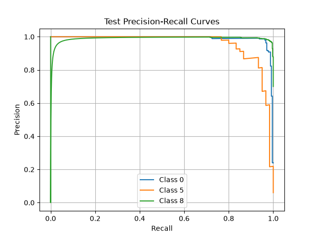
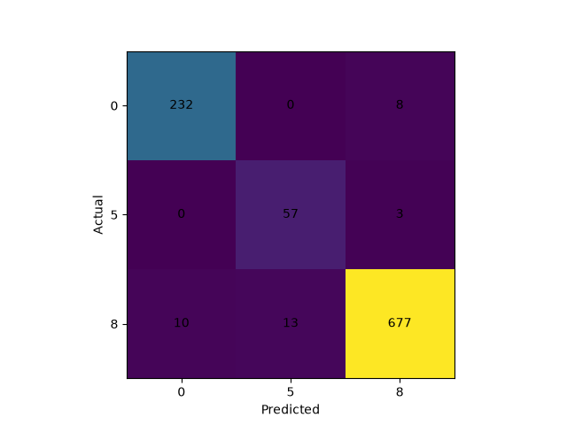
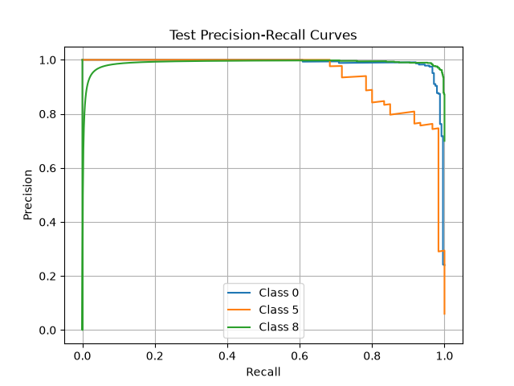

# buzz-solutions-project
This repository contains an implementation of the Buzz Solutions challenge

# Setting up
You can install the necessary libraries by entering the repo and running
`uv sync`

# Data Download
Data can be downloaded using the following command:
`uv run digit-classification download-data --data_dir <download location>`

# Model Training
Training the model can be run with:
`uv run digit-classification train --data-dir <data location> --output-dir <output location>`

Other parameters:
 - learning_rate - (default: 0.001)
 - hidden_dims - specifies hidden layers and the number of filters per layer (default: [32, 64])
 - no_hidden - specifies if no hidden layers wanted (default: False)
 - pool_indexes - allows the user to specify which layers from hidden_dims have pooling layers (default: [])
 - batch_size - (default: 64)
 - num_workers - (default: 4)
 - train_fraction - must sum to 1.0 with val_fraction and test_fraction (default: 0.6)
 - val_fraction - must sum to 1.0 with train_fraction and test_fraction (default: 0.2)
 - test_fraction - must sum to 1.0 with train_fraction and val_fraction (default: 0.2)
 - use_weighted_sampler - flag to sample data evenly (default: False)

## Looking at Training Metrics
To look at training and validation metrics use `tensorboard`:
`uv run tensorboard --logdir <output_dir>`

# Model Evaluation
Model evaluation can be run with:
`uv run digit-classification evaluate --data-dir <data dir> --checkpoint-path <checkpoint path> --output-dir <output dir NOTE: if you specify lightning_logs/version_<x> from Model Training it will save results there>`

Other Parameters:
 - batch_size - (default: 64)
 - num_workers - (default: 4)
 - train_fraction - must sum to 1.0 with val_fraction and test_fraction (default: 0.6)
 - val_fraction - must sum to 1.0 with train_fraction and test_fraction (default: 0.2)
 - test_fraction - must sum to 1.0 with train_fraction and val_fraction (default: 0.2)

   
NOTE: It is important to keep percentages consistent between training and evaluation

## Looking at Test Metrics
`uv run tensorboard --logdir <output_dir>`

# Predicting with Model
To predict run:
`uv run digit-classification predict --image-path  --checkpoint-path <checkpoint path>`

Note: There are some images in the `examples` directory

# Simple Experiment
For a simple experiment I trained two simple linear classification models with the only change the use of a weighted random sampler to ensure that the smallest class (5) is sampled with the same frequency as the largest class (8).
## Without Weighted Random Sampler

## With Weighted Random Sampler

